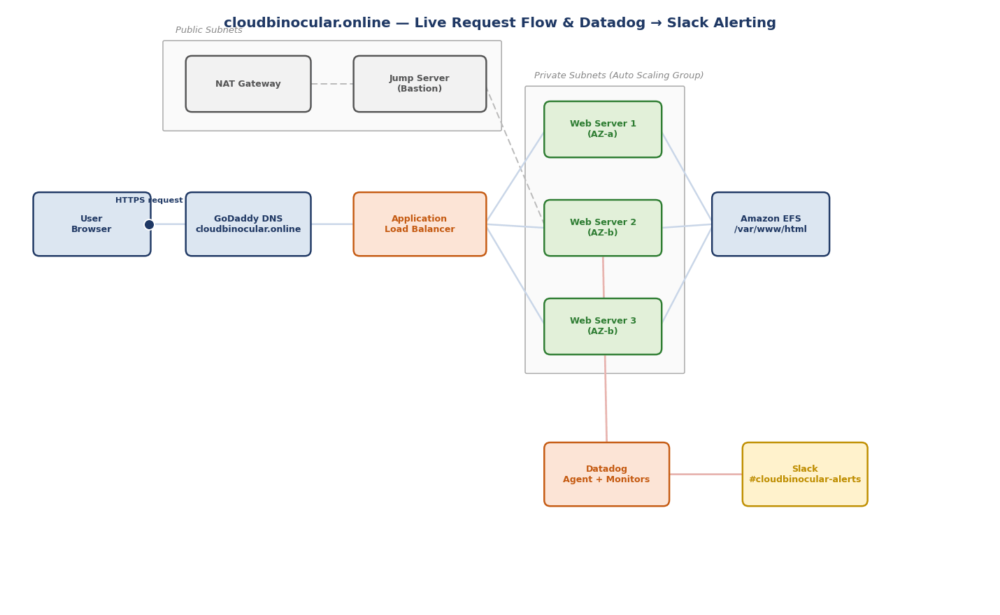

# CloudBinocular.online — High Availability Web Infrastructure on AWS

**Build Log, Troubleshooting Record & Command Runbook**
Region: `eu-north-1` | POD5, Engineer Kandance

--------------------------------------------------------------------------------------

## 1. Project Overview

This document records the full build-out of a highly available, auto-scaling web infrastructure on AWS for the domain **cloudbinocular.online**, including every blocker hit along the way, its root cause, and the exact fix applied. It is written so the entire environment can be rebuilt from scratch without re-discovering the same problems twice.

### Architecture Summary

- Custom VPC across **two Availability Zones** in `eu-north-1`, with public and private subnets in each AZ
- **Public subnets** host: an Internet-facing Application Load Balancer, a NAT Gateway, and a bastion/jump server
- **Private subnets** host: 3x EC2 instances in an Auto Scaling Group (min 3 / max as configured), running **Nginx**
- **Amazon EFS** mounted at `/var/www/html/` on every web server (and the jump server) as shared storage — a save on one server appears on all servers instantly
- **Application Load Balancer** terminates HTTPS using an **AWS Certificate Manager (ACM)** certificate and forwards to the target group
- **Route 53 / GoDaddy DNS** points `cloudbinocular.online` and `www.cloudbinocular.online` at the ALB
- **Datadog Agent** installed on all 3 private web servers, reporting CPU metrics, with 3 monitors (Warning / Critical / Emergency) alerting to Slack channel `#cloudbinocular-alerts`

A companion animated architecture diagram (GIF) accompanies this document, showing the live request flow and the monitoring/alert flow side by side.



---------------------------------------------------------------------------------------------------------------------------------

## 2. End-to-End Command Runbook

This section is the exact sequence to go from a cold login in MobaXterm to a fully live website, assuming the AWS resources (VPC, ALB, ASG, EFS, ACM, Launch Template) already exist. Replace placeholder values (IPs, key paths, API keys) with your own.

### 2.1 Connect to the Jump Server

Store the private key locally — **never on a cloud-synced drive** (Google Drive / OneDrive) — since a sync client that isn't running or signed in will make the key file inaccessible.

Local key path:
```
C:\Users\<you>\Desktop\CloudB\cloudbinocular-keypair.pem
```

In MobaXterm, start a new SSH session to the jump server's public IP using that key and username `ubuntu`. Once connected:

```bash
df -h
ls -la /var/www/html/
```

Confirms EFS is mounted at `/var/www/html/` (look for a line like `10.0.x.x:/ on /var/www/html`) and that the shared site files are visible.

### 2.2 Hop From the Jump Server Into a Private Web Server

Private instances have no public IP, so they are only reachable from inside the VPC — via the jump server. Copy the key onto the jump server once (drag-and-drop through MobaXterm's SFTP panel into `/home/ubuntu/.ssh/`), then:

```bash
mkdir -p ~/.ssh
chmod 400 ~/.ssh/cloudbinocular-keypair.pem
ssh -i ~/.ssh/cloudbinocular-keypair.pem ubuntu@<PRIVATE_IP>
```

Repeat for each private instance's private IP (found in the EC2 console). On each one, confirm the web stack:

```bash
systemctl status nginx
df -h
ls -la /var/www/html/
```

### 2.3 Install / Verify the Datadog Agent (per private server)

Use the current Datadog install endpoint — the older `s3.amazonaws.com/dd-agent-bootstrap` URL referenced in some older guides is dead:

```bash
DD_API_KEY=<YOUR_DATADOG_API_KEY> DD_SITE="datadoghq.com" \
bash -c "$(curl -L https://install.datadoghq.com/scripts/install_script_agent7.sh)"

sudo systemctl status datadog-agent
```

Status should read `active (running)`. Repeat on all private servers. Then update the Auto Scaling Group's Launch Template user data with the same corrected two lines above, and publish it as the new default version, so any future replacement instance installs the agent automatically and correctly.

### 2.4 Publish Website Content

Because `/var/www/html/` is EFS-backed, uploading files once (via the jump server's SFTP panel in MobaXterm, or the command below) instantly propagates to every private server.

From a machine that already has the files locally, using `scp` through the jump server as a proxy:

```bash
scp -i cloudbinocular-keypair.pem -o ProxyJump=ubuntu@<JUMP_PUBLIC_IP> \
  index.html style.css script.js ubuntu@<PRIVATE_IP>:/var/www/html/
```

Or simply drag-and-drop the files into MobaXterm's left SFTP panel while browsing `/var/www/html/` on the jump server session. Verify:

```bash
ls -la /var/www/html/
```

### 2.5 DNS (GoDaddy)

- **CNAME record** — Name: `www` — Value: `<your-ALB-DNS-name>.elb.amazonaws.com`
- **Root domain (@)** — use GoDaddy "Forwarding" to redirect `cloudbinocular.online` → `https://www.cloudbinocular.online` (GoDaddy does not allow CNAME on the root)

### 2.6 SSL Certificate (ACM)

Request a public certificate covering both names in the same request (or a single name plus wildcard):

- `cloudbinocular.online`
- `www.cloudbinocular.online`

Choose **DNS validation**. ACM will provide one CNAME validation record per name. Add each exactly as shown in ACM — including any subdomain prefix such as `.www` before the zone name — into GoDaddy. Wait for status **Issued**, then attach the certificate to the ALB's HTTPS:443 listener (Listeners tab → Edit → Default SSL certificate).

### 2.7 Final Verification

```bash
curl -I https://www.cloudbinocular.online
```

Expect `HTTP/2 200` with no certificate warning. Confirm in a fresh Incognito window as well, to rule out cached DNS.

---

See [`TROUBLESHOOTING.md`](TROUBLESHOOTING.md) for every blocker encountered during this build, its root cause, and the fix applied.
